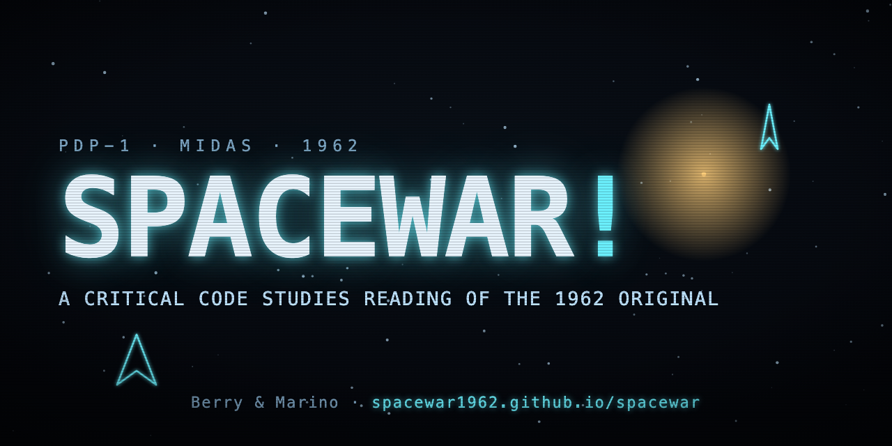

<p align="center">
  <a href="https://spacewar1962.github.io/spacewar/">
    
  </a>
</p>

<h1 align="center">Spacewar! (1962): A Critical Code Studies Reading</h1>

<p align="center">
  <a href="https://spacewar1962.github.io/spacewar/"></a>
  <a href="https://github.com/spacewar1962/spacewar/releases"></a>
  <a href="LICENSE"></a>
</p>

A critical code reading of **_Spacewar!_**, the space-combat game written for the DEC PDP-1 at MIT in 1961–62. We read the original Macro assembly source as a cultural text, in the tradition of Critical Code Studies: at once literature, mechanism, spatial form, and a repository of the social formation that produced it.

This repository holds the original source, a runnable PDP-1 emulator, and the project website, so the reading can move between the text and its execution. _Spacewar!_ sits at an origin point of computational culture: real-time interactive graphics, the hacker ethic, the demo, and the free circulation of code all condense in roughly two thousand words of macro-assembly. Reading about the origins of computing is not the same as reading the origin's code, and the aim here is the latter, to sit with the listing, the macros, the octal addresses, and the running artefact, and to ask what this code knows, what it assumes, and what its founding myth leaves out.

The project develops along several lines. Its principal output is a **monograph** that grows from the close reading, working through the source movement by movement and setting each fragment in its cultural constellation. Around the writing we treat programming as scholarship, using the emulator to run, modify, and port the program so that interpretation is tested against the artefact, and we read the visual register of the Type 30 display in conjunction with the code that produces it, binding critical code studies to a visual and media-archaeological analysis. A variorum across the surviving versions, with links to recovered source where it exists, is compiled as the project's [Code page](https://spacewar1962.github.io/spacewar/code.html); because there is no single canonical _Spacewar!_, the differences between versions, gravity added in one, the on-screen score in another, the subjective view in another still, are themselves evidence the reading works from. Further threads include a fuller account of the paratexts and the political economy of the gift economy that circulated the source inside a Cold-War research budget.

The reading is a companion to _Inventing ELIZA: How the First Chatbot Shaped the Future of AI_ (MIT Press, 2026). They are two foundational programs of the long 1960s, read side by side: ELIZA teaches the machine to talk, _Spacewar!_ teaches it to play. The site's [Two Cultures](https://spacewar1962.github.io/spacewar/two-cultures.html) page reads them as a fork in MIT's early computer culture, the machine as a medium and the machine as a mind, and the line that runs from there to today's debates over artificial intelligence.

## Explore

- 🌐 **Project site:** <https://spacewar1962.github.io/spacewar/>
- ❓ **Why this project matters today:** <https://spacewar1962.github.io/spacewar/why.html>
- 🗂 **The versions:** <https://spacewar1962.github.io/spacewar/code.html> · a variorum of the surviving _Spacewar!_ code, 1962–63, with links to recovered source where it exists.
- 👥 **The people:** <https://spacewar1962.github.io/spacewar/people.html> · who conceived, wrote, extended, and preserved _Spacewar!_, and who the record leaves out.
- 🕰 **Timeline:** <https://spacewar1962.github.io/spacewar/timeline.html> · an interactive timeline of _Spacewar!_ from 1961 to now.
- 🚀 **Ports and the long journey:** <https://spacewar1962.github.io/spacewar/ports.html> · the census of ports and clones across machines and labs, with deep dives into [Cambridge](https://spacewar1962.github.io/spacewar/cambridge.html), [Minnesota](https://spacewar1962.github.io/spacewar/minnesota.html), [Stanford](https://spacewar1962.github.io/spacewar/stanford.html), [MIT-AI](https://spacewar1962.github.io/spacewar/mit-ai.html), and the [PDP-11](https://spacewar1962.github.io/spacewar/pdp11.html), plus a tentative survey of commercial descendants.
- 🛠 **Restorations:** <https://spacewar1962.github.io/spacewar/restoration.html> · hardware restorations, FPGA rebuilds, and faithful emulation that keep the game runnable.
- 🎮 **Spacewar! overview:** <https://spacewar1962.github.io/spacewar/overview.html> · the deep-dive on the game itself, design, play, strategy, and where to read each thread.
- 🖥 **The PDP-1:** <https://spacewar1962.github.io/spacewar/pdp1.html> · a deep dive into the machine the game was written for, with companion pages on [programming the PDP-1](https://spacewar1962.github.io/spacewar/programming.html) (including an interactive instruction-set lookup), the [Type 30 display](https://spacewar1962.github.io/spacewar/type30.html), the [software environment](https://spacewar1962.github.io/spacewar/software.html), the PDP-1 [as a games machine](https://spacewar1962.github.io/spacewar/games.html) and [as a media machine](https://spacewar1962.github.io/spacewar/music.html) (Samson's Harmony Compiler and Raj Reddy's speech recognition).
- 🏢 **The DEC family:** the [PDP family comparative table](https://spacewar1962.github.io/spacewar/dec-family.html), [PDPs at universities](https://spacewar1962.github.io/spacewar/dec-universities.html), and [the legacy of the PDP](https://spacewar1962.github.io/spacewar/dec-legacy.html) (VAX, VMS, Unix).
- ✶ **The Minskytron:** <https://spacewar1962.github.io/spacewar/minskytron.html> · Minsky's display hack and the circle algorithm behind the hyperspace effect.
- 🔀 **Two Cultures:** <https://spacewar1962.github.io/spacewar/two-cultures.html> · the fork in MIT's early computer culture, the machine as a medium (_Spacewar!_) and the machine as a mind (_ELIZA_).
- 🕹 **Play the 1962 original:** <https://spacewar1962.github.io/spacewar/play.html>
- 📚 **Bibliography:** <https://spacewar1962.github.io/spacewar/bibliography.html>
- 🖥 **Alternate front pages:** [text (1990s)](https://spacewar1962.github.io/spacewar/index-text.html) · [vector display](https://spacewar1962.github.io/spacewar/index-vector.html)
- ↯ **Easter egg:** type `minsky` on the front page to summon the Minskytron, the PDP-1 display hack that came before _Spacewar!_ (and gave it the hyperspace effect). It draws live on the page, with a link to the [original emulation](https://www.masswerk.at/minskytron/).

## The object

The original Macro assembly source is preserved here alongside its assembler listing, a provenance snapshot, and a working PDP-1 emulator, so that the reading can move between text and execution. (The 1962 source is written in Macro, the PDP-1 assembler descended from the one built for the TX-0; MIDAS, often cited in later accounts, is a later assembler built on it.)

| File | What it is |
|------|------------|
| [`spacewar.mac`](spacewar.mac) | The original Macro assembly source (~2,000 lines), preserved in this fork. |
| [`spacewar.lst`](spacewar.lst) | The assembler listing: octal addresses and machine words beside each line. The program as it sits in core. |
| [`originsources.zip`](originsources.zip) | A dated upstream snapshot, tracing the source back through the Silverman / Gerasimov PDP-1 emulator. |
| `spacewar.js`, `spacewar.bin.js` | The PDP-1 emulator that runs the 1962 binary in the browser. |
| `index.html` + the section pages (`why`, `people`, `timeline`, `overview`, `ports`, `restoration`, `pdp1`, `programming`, `type30`, `software`, `games`, `music`, `pdp11`, `minskytron`, `two-cultures`, `play`, `bibliography`, the port deep-dives `cambridge` / `minnesota` / `stanford` / `mit-ai`, and the DEC-family pages `dec-family` / `dec-universities` / `dec-legacy`) | The project website (served via GitHub Pages), with a grouped dropdown menu: **The Game** (overview, versions, play), **Ports**, **PDP-1** (the machine, programming with a live instruction-set lookup from `assets/pdp1-instructions.json`, the Type 30 display, software environment, as a games/media machine), and **DEC** (the PDP family table, PDPs at universities, the legacy). |
| [`code.html`](code.html) | The versions: a variorum of the surviving _Spacewar!_ source, 1962–63, with per-version links to recovered code. |
| `index-text.html`, `index-vector.html` | Alternate front pages: a 1990s text-only version and a vector-display version. |
| `assets/`, `*.css` | Site styling and brand assets. |
| `bibliography.source.md`, `build-bibliography.py` | The bibliography and the generator that renders it. |
| [`docs/`](docs/) | Public reading notes: the reading log, close-reading memos, and the working diffusion catalogue (versions, ports, and commercial descendants). |
| [`code/`](code/) | Working space for programming as scholarship (modifications, variations, ports). For future use. |

## The reading

The study works across the registers of Critical Code Studies, pairing close technical explication of a code fragment with the cultural constellation that spirals out from it. Six movements: the machine that owns itself; the Macro assembler's macros as a small language for writing the game; the Expensive Planetarium and its real sky; gravity and the central star; hyperspace as designed contingency; and the demo as gift.

Alongside close reading, we treat programming as scholarship, using the emulator to run, modify, and port the program, so interpretation is tested against the artefact rather than asserted about it. _Spacewar!_ is also, immediately, an image, a vector drawing on the Type 30 display, so we read the visual register in conjunction with the code that produces it, binding critical code studies to a visual and media-archaeological analysis of the display itself.

## Running locally

The site is static. From a clone of this repository:

```sh
python3 -m http.server 8000
# then open http://localhost:8000/
```

The bibliography page is generated. Edit [`bibliography.source.md`](bibliography.source.md), then:

```sh
python3 build-bibliography.py    # rewrites bibliography.html
```

## Contributing

`main` is protected and always reflects the live site. Changes go through a branch and a pull request with one review. See [`CONTRIBUTING.md`](CONTRIBUTING.md) for the workflow. The `stable` branch and the version tags are restore points; please do not push to them.

## Project leads

- **Professor David M. Berry**, University of Sussex (d.m.berry@sussex.ac.uk)
- **Professor Mark C. Marino**, University of Southern California (mcmarino@usc.edu)

## Provenance and licence

_Spacewar!_ was created in 1961–62 by Steve Russell, Martin Graetz, Wayne Wiitanen, and others in the circle around MIT's Tech Model Railroad Club, with the Expensive Planetarium by Peter Samson, gravity by Dan Edwards, and control boxes by Alan Kotok and Bob Saunders. The source and emulator preserved here descend from the canonical PDP-1 emulator by Barry Silverman, Brian Silverman, and Vadim Gerasimov (`spacewar.oversigma.com`), forked into this organisation for the reading. The original game is in the public domain; the emulator and surrounding code are distributed under the **GNU Affero General Public License v3.0** (see [`LICENSE`](LICENSE)).

## Acknowledgements

This reading builds on the Critical Code Studies tradition developed by Mark C. Marino and David M. Berry, and on the work of the historians and preservationists who recovered and ran this code. We are especially indebted to the remarkable work of **Norbert Landsteiner**, whose emulations, reconstructions, source listings, and software-archaeological analyses of _Spacewar!_ and the Minskytron at [masswerk.at/spacewar](https://www.masswerk.at/spacewar/) this project draws on throughout.
